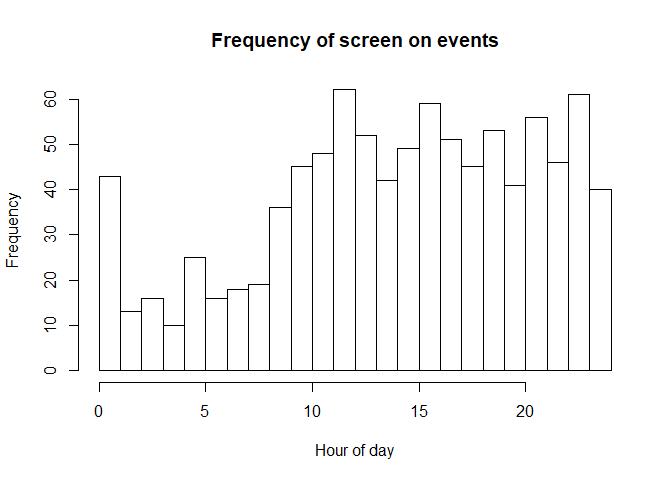

Sleep Prediction
================

<!-- To commit and then push all local file changes to the github repository: -->

<!-- 1) Open up Git Bash -->

<!-- 2) Change directory to "C:/Users/Ian/Dropbox/SleepScreenOnOff/SleepEstimation" -->

<!-- 3) git add . -->

<!-- 4) git commit -m "Commit name here" -->

<!-- 5) git push origin master -->

\#\#\#Create example screen on/off dataset

The following code generates some example screen on/off data for
*ndays=10* days of follow up, with average time to bed at 1:00AM
(*mu\_s=1*) with std. dev. *sd\_s=1* hour. Average time to wake up is
8:30AM (*mu\_w=8.5*) with std. dev. *sd\_w=0.5*. Time between screen on
events is generated according to an exponential distribution with rate
*lambda\_s=0.3* when the person is asleep and rate *lambda\_w=2* when
the person is awake. Smaller rates imply longer waiting times between
phone use, as we might expect when a person is asleep. The *anchor\_t*
parameter should represent an hour of the day that is unlikely to occur
during sleep. In this example *anchor\_t=14* corresponds to 2:00PM. The
starting hour on the first day when data is first collected is
*init\_t=15* (3:00PM).

The generated data is stored in the outmat matrix. This matrix has three
columns, column 1 is the starting time (in hours) of the screen off
interval, column 2 is the ending time (in hours) of the screen off
interval, with column 3 corresponding to the day of follow-up. Note that
starting times (Column 1) are on the interval
*\[anchor\_t,anchor\_t+24\]* rather than *\[0,24\]*. To see the screen
off intervals (*outmat\_mod*) in time-date format where *d0* is the
variable representing the first day of followup, see the *outmat\_orig*
matrix. The *Mod2Orig()* and *Orig2Mod()* functions convert back and
forth between these two data formats (the formats represented by
*outmat\_mod* and *outmat\_orig*).

``` r
ndays=10
lambda_s = 1.5
lambda_w = 5
mu_s = 1
mu_w = 8.5
sd_s = .5
sd_w = .25
init_t = 15
anchor_t=14
d0="3/2/2019" ## d0 is the first day of follow-up. If you have your own data, set d0 equal to the date of first data.

#2pm = origin
A2B_ts = function(xx,anchor_hr=14){
  if(length(xx)>1){
    for(i in 1:length(xx)){
      if(xx[i]<=anchor_hr){
        xx[i]=(24-anchor_hr)+xx[i]
      }else{
        xx[i]=xx[i]-anchor_hr
      }
    }
    return(xx)
  }else{
    if(xx<=anchor_hr){
      return(24-anchor_hr+xx)
    }else{
      return(xx-anchor_hr)
    }
  }
}

## generate time to bed/wake for each day
t_s = rnorm(ndays,mu_s,sd_s)
t_w = rnorm(ndays,mu_w,sd_w)

## generate waiting times
curt = init_t
curday=1
outmat_mod=c()
while(TRUE){
  if(curt>init_t+24){
    curt = curt-24
    curday=curday+1
    if(curday>ndays){
      break
    }
  }
  if(A2B_ts(curt)<A2B_ts(t_s[curday])){
    tnex = curt+rexp(1,lambda_w)
    if(A2B_ts(tnex)>=A2B_ts(t_s[curday])){
      tnex = curt+A2B_ts(t_s[curday])-A2B_ts(curt)+rexp(1,lambda_s)
    }
    outmat_mod=rbind(outmat_mod,c(curt,tnex,curday))
  }else if(A2B_ts(curt)<A2B_ts(t_w[curday])){
    tnex = curt+rexp(1,lambda_s)
    if(A2B_ts(tnex)>=A2B_ts(t_w[curday])){
      tnex = curt+A2B_ts(t_w[curday])-A2B_ts(curt)+rexp(1,lambda_w)
    }
    outmat_mod=rbind(outmat_mod,c(curt,tnex,curday))
  }else{
    tnex = curt+rexp(1,lambda_w)
    outmat_mod=rbind(outmat_mod,c(curt,tnex,curday))
  }
  curt=tnex
}

Mod2Orig = function(tmat,d0,format="%m/%d/%Y %H:%M:%S",tz="EST"){
  tmat_out = matrix(NA,nrow=nrow(tmat),ncol=2)
  t0=as.POSIXct(paste(d0,"00:00:00",sep=" "),tz=tz,format)
  for(i in 1:nrow(tmat)){
    tmat_out[i,1]=strftime(as.POSIXct(as.numeric(t0)+60*60*(tmat[i,1]+24*tmat[i,3]),tz=tz,origin="1970-01-01"),tz="EST",format)
    tmat_out[i,2]=strftime(as.POSIXct(as.numeric(t0)+60*60*(tmat[i,2]+24*tmat[i,3]),tz=tz,origin="1970-01-01"),tz="EST",format)
  }
  return(data.frame(t0=tmat_out[,1],t1=tmat_out[,2],stringsAsFactors=F))
}

Orig2Mod = function(tmat,anchor_hr,format="%m/%d/%Y %H:%M:%S",tz="EST"){
  tmat_out = matrix(NA,nrow=nrow(tmat),ncol=3)
  for(i in 1:nrow(tmat)){
    anchor_cur=anchor_hr*60*60+as.numeric(as.POSIXct(strftime(as.POSIXct(tmat[i,1],tz=tz,format=format,origin="1970-01-01"),tz=tz,format="%m/%d/%Y"),tz=tz,format="%m/%d/%Y"))
    if(as.numeric(as.POSIXct(tmat[i,1],tz=tz,format=format,origin="1970-01-01"))<anchor_cur){
      anchor_cur=anchor_hr*60*60+as.numeric(as.POSIXct(strftime(as.POSIXct(as.numeric(as.POSIXct(tmat[i,1],tz=tz,format=format,origin="1970-01-01"))-24*60*60,tz=tz,origin="1970-01-01"),tz=tz,format="%m/%d/%Y"),tz=tz,format="%m/%d/%Y"))
    }
    if(i==1){anchor0=anchor_cur}
    tmat_out[i,1]=anchor_hr+(as.numeric(as.POSIXct(tmat[i,1],tz=tz,format=format,origin="1970-01-01"))-anchor_cur)/(60*60)
    tmat_out[i,2]=anchor_hr+(as.numeric(as.POSIXct(tmat[i,2],tz=tz,format=format,origin="1970-01-01"))-anchor_cur)/(60*60)
    tmat_out[i,3]=round((anchor_cur-anchor0)/(24*60*60))+1
  }
  return(tmat_out)
}

outmat_orig=Mod2Orig(outmat_mod,d0,format="%m/%d/%Y %H:%M:%S") #d0 tells Mod2Orig when the first day of follow-up is.
compare_to_outmat_mod=Orig2Mod(outmat_orig,anchor_hr=anchor_t)

head(outmat_orig)
```

    ##                    t0                  t1
    ## 1 03/03/2019 15:00:00 03/03/2019 15:01:24
    ## 2 03/03/2019 15:01:24 03/03/2019 15:07:07
    ## 3 03/03/2019 15:07:07 03/03/2019 15:10:30
    ## 4 03/03/2019 15:10:30 03/03/2019 15:14:44
    ## 5 03/03/2019 15:14:44 03/03/2019 15:25:43
    ## 6 03/03/2019 15:25:43 03/03/2019 15:52:49

``` r
head(outmat_mod)
```

    ##          [,1]     [,2] [,3]
    ## [1,] 15.00000 15.02355    1
    ## [2,] 15.02355 15.11874    1
    ## [3,] 15.11874 15.17514    1
    ## [4,] 15.17514 15.24565    1
    ## [5,] 15.24565 15.42864    1
    ## [6,] 15.42864 15.88029    1

``` r
head(compare_to_outmat_mod)
```

    ##          [,1]     [,2] [,3]
    ## [1,] 15.00000 15.02333    1
    ## [2,] 15.02333 15.11861    1
    ## [3,] 15.11861 15.17500    1
    ## [4,] 15.17500 15.24556    1
    ## [5,] 15.24556 15.42861    1
    ## [6,] 15.42861 15.88028    1

To see what the resulting data looks
like:

``` r
hist(outmat_mod[,1] %% 24,breaks=24,xlim=c(0,24),xlab="Hour of day",main="Frequency of screen on events")
```

<!-- --> Notice how
there are fewer screen on events During the nighttime hours, as
expected.

### Gaussian quadrature for bivariate integration

The time to bed *x\_s* and time to wake *x\_w* is unknown for each night
of follow-up. In this approach, we treat *(x\_s,x\_w)* as a bivariate
normal random variable with mean *(mu\_s,mu\_w)* with
*cor(x\_s,x\_w)=rho* and marginal variances
*(sigma\_s<sup>2,sigma\_w</sup>2)*. To calculate the marginal likelihood
we integrate over the conditional likelihood with respect to
*(x\_s,x\_w)* for each night in follow up. Because this is a Gaussian
integral it can be done efficiently using Guassian quadrature, more
specifically Gauss-Hermite quadrature. The code for this is here:

``` r
## perform quadrature of multivariate normal

## compute Gauss-Hermite quadrature points and weights
## for a one-dimensional integral.
## points -- number of points
## interlim -- maximum number of Newton-Raphson iterations

library(mvtnorm)

hermite <- function (points, z) {
  p1 <- 1/pi^0.4
  p2 <- 0
  for (j in 1:points) {
    p3 <- p2
    p2 <- p1
    p1 <- z * sqrt(2/j) * p2 - sqrt((j - 1)/j) * p3
  }
  pp <- sqrt(2 * points) * p2
  c(p1, pp)
}

gauss.hermite <- function (points, iterlim = 50) {
  x <- w <- rep(0, points)
  m <- (points + 1)/2
  for (i in 1:m) {
    z <- if (i == 1) 
      sqrt(2 * points + 1) - 2 * (2 * points + 1)^(-1/6)
    else if (i == 2) 
      z - sqrt(points)/z
    else if (i == 3 || i == 4) 
      1.9 * z - 0.9 * x[i - 2]
    else 2 * z - x[i - 2]
    for (j in 1:iterlim) {
      z1 <- z
      p <- hermite(points, z)
      z <- z1 - p[1]/p[2]
      if (abs(z - z1) <= 1e-15) 
        break
    }
    if (j == iterlim) 
      warning("iteration limit exceeded")
    x[points + 1 - i] <- -(x[i] <- z)
    w[i] <- w[points + 1 - i] <- 2/p[2]^2
  }
  r <- cbind(x * sqrt(2), w/sum(w))
  colnames(r) <- c("Points", "Weights")
  r
}


## compute multivariate Gaussian quadrature points
## n     - number of points each dimension before pruning
## mu    - mean vector
## sigma - covariance matrix
## prune - NULL - no pruning; [0-1] - fraction to prune
mgauss.hermite <- function(n, mu, sigma, prune=NULL) {
  if(!all(dim(sigma) == length(mu)))
    stop("mu and sigma have nonconformable dimensions")
  
  dm  <- length(mu)
  gh  <- gauss.hermite(n)
  #idx grows exponentially in n and dm
  idx <- as.matrix(expand.grid(rep(list(1:n),dm)))
  pts <- matrix(gh[idx,1],nrow(idx),dm)
  wts <- apply(matrix(gh[idx,2],nrow(idx),dm), 1, prod)
  
  ## prune
  if(!is.null(prune)) {
    qwt <- quantile(wts, probs=prune)
    pts <- pts[wts > qwt,]
    wts <- wts[wts > qwt]
  }
  
  ## rotate, scale, translate points
  eig <- eigen(sigma) 
  rot <- eig$vectors %*% diag(sqrt(eig$values))
  pts <- t(rot %*% t(pts) + mu)
  return(list(points=pts, weights=wts))
}
```

### Estimating model parameters

Next, we write the likelihood function and use Hermite-Gauss quadrature
to perform numerical integration over the unknown bedtimes and wake-up
times (*x\_s* and *x\_w*). We do a grid search over some of the
parameter space (*rho*, *sigma\_s*, and *sigma\_w*) to pick an initial
value for the numerical optimization of the likelihood, but we make
smarter data-based guesses as initial values for the remaing parameters
(*mu\_s*, *mu\_w*, *lambda\_s*, and *lambda\_w*). Note that we also
allow for the option of setting *rho* equal to zero. This is controlled
by the boolean *incl\_rho* parameter in the FindParamMLEs function, with
a default value of false.

``` r
IndLik = function(t_init,wt,xs,xw,lambda_s,lambda_w,mu_s,mu_w){
  if(t_init+wt>mu_s+24){ # return pr(t_init+wt>mu_s+24) instead of density
    if(t_init<xs){
      denom=1-exp(-lambda_w*(xs-t_init))+exp(-lambda_s*(xs-t_init))-exp(-lambda_s*(xw-t_init))+exp(-lambda_w*(xw-t_init))-exp(-lambda_w*(mu_s+24-t_init))+(1/(1-exp(-lambda_s*24)))*(exp(-lambda_s*(mu_s+24-t_init))-exp(-lambda_s*(mu_w+24-t_init)))+(1/(1-exp(-lambda_w*24)))*(exp(-lambda_s*(mu_w+24-t_init))-exp(-lambda_w*(mu_w+48-t_init)))
      numer=(1/(1-exp(-lambda_s*24)))*(exp(-lambda_s*(mu_s+24-t_init))-exp(-lambda_s*(mu_w+24-t_init)))+(1/(1-exp(-lambda_w*24)))*(exp(-lambda_s*(mu_w+24-t_init))-exp(-lambda_w*(mu_w+48-t_init)))
      return(numer/denom)
    }else if(t_init<xw){
      denom=1-exp(-lambda_s*(xw-t_init))+exp(-lambda_w*(xw-t_init))-exp(-lambda_w*(mu_s+24-t_init))+(1/(1-exp(-lambda_s*24)))*(exp(-lambda_s*(mu_s+24-t_init))-exp(-lambda_s*(mu_w+24-t_init)))+(1/(1-exp(-lambda_w*24)))*(exp(-lambda_s*(mu_w+24-t_init))-exp(-lambda_w*(mu_w+48-t_init)))
      numer=(1/(1-exp(-lambda_s*24)))*(exp(-lambda_s*(mu_s+24-t_init))-exp(-lambda_s*(mu_w+24-t_init)))+(1/(1-exp(-lambda_w*24)))*(exp(-lambda_s*(mu_w+24-t_init))-exp(-lambda_w*(mu_w+48-t_init)))
      return(numer/denom)
    }else{
      denom=1-exp(-lambda_w*(mu_s+24-t_init))+(1/(1-exp(-lambda_s*24)))*(exp(-lambda_s*(mu_s+24-t_init))-exp(-lambda_s*(mu_w+24-t_init)))+(1/(1-exp(-lambda_w*24)))*(exp(-lambda_s*(mu_w+24-t_init))-exp(-lambda_w*(mu_w+48-t_init)))
      numer=(1/(1-exp(-lambda_s*24)))*(exp(-lambda_s*(mu_s+24-t_init))-exp(-lambda_s*(mu_w+24-t_init)))+(1/(1-exp(-lambda_w*24)))*(exp(-lambda_s*(mu_w+24-t_init))-exp(-lambda_w*(mu_w+48-t_init)))
      return(numer/denom)
    }
  }
  if(t_init<xs){
    denom=1-exp(-lambda_w*(xs-t_init))+exp(-lambda_s*(xs-t_init))-exp(-lambda_s*(xw-t_init))+exp(-lambda_w*(xw-t_init))-exp(-lambda_w*(mu_s+24-t_init))+(1/(1-exp(-lambda_s*24)))*(exp(-lambda_s*(mu_s+24-t_init))-exp(-lambda_s*(mu_w+24-t_init)))+(1/(1-exp(-lambda_w*24)))*(exp(-lambda_s*(mu_w+24-t_init))-exp(-lambda_w*(mu_w+48-t_init)))
    if(t_init+wt<xs){
      return(lambda_w*exp(-lambda_w*(wt))/denom)
    }else if(t_init+wt<xw){
      return(lambda_s*exp(-lambda_w*(xs-t_init)-lambda_s*(t_init+wt-xs))/denom)
    }else{
      return(lambda_w*exp(-lambda_w*(xs-t_init)-lambda_s*(xw-xs)-lambda_w*(t_init+wt-xw))/denom)
    }
  }else if(t_init<xw){
    denom=1-exp(-lambda_s*(xw-t_init))+exp(-lambda_w*(xw-t_init))-exp(-lambda_w*(mu_s+24-t_init))+(1/(1-exp(-lambda_s*24)))*(exp(-lambda_s*(mu_s+24-t_init))-exp(-lambda_s*(mu_w+24-t_init)))+(1/(1-exp(-lambda_w*24)))*(exp(-lambda_s*(mu_w+24-t_init))-exp(-lambda_w*(mu_w+48-t_init)))
    if(t_init+wt<xw){
      return(lambda_s*exp(-lambda_s*(wt))/denom)
    }else{
      return(lambda_w*exp(-lambda_s*(xw-t_init)-lambda_w*(t_init+wt-xw))/denom)    
    }
  }else{
    denom=1-exp(-lambda_w*(mu_s+24-t_init))+(1/(1-exp(-lambda_s*24)))*(exp(-lambda_s*(mu_s+24-t_init))-exp(-lambda_s*(mu_w+24-t_init)))+(1/(1-exp(-lambda_w*24)))*(exp(-lambda_s*(mu_w+24-t_init))-exp(-lambda_w*(mu_w+48-t_init)))
    return(lambda_w*exp(-lambda_w*(wt))/denom)
  }
}


JointLik = function(mat,mu_s,mu_w,sigma_s,sigma_w,rho,lambda_s,lambda_w,x_s,x_w,INCL_DENSITY=FALSE,loglik=FALSE,incl_rho=FALSE){
  if(x_s>x_w){
    if(loglik){
      return(-Inf)
    }else{
      return(0)
    }
  }
  if(!is.null(nrow(mat)) && nrow(mat)>0){
    if(loglik){
      t1=0
      for(i in 1:nrow(mat)){
        t1=t1+log(IndLik(mat[i,1],mat[i,2]-mat[i,1],x_s,x_w,lambda_s,lambda_w,mu_s,mu_w))
      }
    }else{
      t1=1
      for(i in 1:nrow(mat)){
        t1=t1*IndLik(mat[i,1],mat[i,2]-mat[i,1],x_s,x_w,lambda_s,lambda_w,mu_s,mu_w)
      }
    }
  }else{
    if(loglik){
      t1=0
    }else{
      t1=1
    }
  }
  if(INCL_DENSITY){
    if(!incl_rho){rho=0}
    if(loglik){
      t2=log(dmvnorm(c(x_s,x_w),mean = c(mu_s,mu_w), sigma= matrix(c(sigma_s^2,rho*sigma_s*sigma_w,rho*sigma_s*sigma_w,sigma_w^2),nrow=2,byrow=T)))
    }else{
      t2=dmvnorm(c(x_s,x_w),mean = c(mu_s,mu_w), sigma= matrix(c(sigma_s^2,rho*sigma_s*sigma_w,rho*sigma_s*sigma_w,sigma_w^2),nrow=2,byrow=T))
    }
  }else{
    if(loglik){
      t2=0
    }else{
      t2=1
    }
  }
  if(loglik){
    return(t1+t2)
  }else{
    return(t1*t2)
  }
}


MargLik = function(mat,mu_s,mu_w,sigma_s,sigma_w,rho,lambda_s,lambda_w,incl_rho,loglik=FALSE){
  if( mu_s> mu_w || sigma_s<0 || sigma_w<0 || abs(rho)>1 || lambda_s<0 || lambda_w <0 || lambda_s > lambda_w){
    if(loglik){
      return(-Inf)
    } else{
      return(0)
    } 
  }
  if(is.null(nrow(mat)) || nrow(mat)==0){
    if(loglik){
      return(0)    
    }else{
      return(1)
    }
  }
  if(incl_rho){
    Sigma=matrix(c(sigma_s^2,rho*sigma_s*sigma_w,rho*sigma_s*sigma_w,sigma_w^2),nrow=2,byrow=T)
  }else{
    Sigma=matrix(c(sigma_s^2,0,0,sigma_w^2),nrow=2,byrow=T)
  }
  ghout=mgauss.hermite(10,c(mu_s,mu_w),Sigma)
  return(sum(ghout$weights*unlist(lapply(1:nrow(ghout$points),function(xx) JointLik(mat,mu_s,mu_w,sigma_s,sigma_w,rho,lambda_s,lambda_w,ghout$points[xx,1],ghout$points[xx,2],loglik,incl_rho)))))
}


InitialParameters = function(mat_mod,anchor_t){
  itrvl_len_v = seq(6,9,.5)
  out_ls=list()
  ratio_v = rep(NA,length(itrvl_len_v))
  # find mu_s0, mu_w0
  for(j in 1:length(itrvl_len_v)){
    itrvl_len=itrvl_len_v[j]
    start_vals=seq(0,24-itrvl_len,.25)
    frac_vals = rep(NA,length(start_vals))
    for(i in 1:length(start_vals)){
      frac_vals[i]=length(intersect(which(mat_mod[,1]>anchor_t+start_vals[i]),which(mat_mod[,1]<anchor_t+start_vals[i]+itrvl_len)))/nrow(mat_mod)
    }
    mu_s0=start_vals[order(frac_vals)[1]]+anchor_t
    mu_w0=mu_s0+itrvl_len
    # find rate during average sleep and average waking interval
    ndays= length(unique(mat_mod[,3]))
    lambda_s0=(min(frac_vals)*nrow(mat_mod)/ndays)/itrvl_len
    lambda_w0=((1-min(frac_vals))*nrow(mat_mod)/ndays)/(24-itrvl_len)
    out_ls[[j]]=list(mu_s0,mu_w0,lambda_s0,lambda_w0)
    ratio_v[j]=lambda_s0/lambda_w0
  }
  return(unlist(out_ls[[order(ratio_v)[1]]]))
}


GridSearchInitPars = function(mat_mod,anchor_t,labels,ls_ids,mu_s0,mu_w0,lambda_s0,lambda_w0,incl_rho){
  sd_s_v = c(.25,.5,1)
  sd_w_v = c(.25,.5,1)
  if(incl_rho){
    rho_v= c(0,.25,.5,.75)
  }else{
    rho_v=c(0)
  }
  g=function(par_v){
    liktot=0
    for(i in 1:length(labels)){
      mat=mat_mod[ls_ids[[i]],1:2]
      liktot=liktot-log(MargLik(mat,par_v[1],par_v[2],par_v[3],par_v[4],par_v[5],par_v[6],par_v[7],incl_rho))
    }
    return(liktot)
  }
  minval=Inf
  for(sd_s in sd_s_v){
    for(sd_w in sd_w_v){
      for(rho in rho_v){
        par_v=c(mu_s0,mu_w0,sd_s,sd_w,rho,lambda_s0,lambda_w0)
        curval=g(par_v)
        if(curval<minval){
          cur_par=par_v
          minval=curval
        }
      }
    }
  }
  return(par_v)
}


FindParamMLEs = function(dat,anchor_t,incl_rho=FALSE,maxiter=20,init_par=NULL,tol=.0001){
  labels=unique(dat[,3])
  ls_ids = list()
  for(i in 1:length(labels)){
    ls_ids[[i]]=which(dat[,3]==i)
  }
  if(is.null(init_par)){
    cat("Identifying good initial model parameters...\n")
    init_pars4=InitialParameters(dat,anchor_t)
    mu_s0=init_pars4[1]
    mu_w0=init_pars4[2]
    lambda_s0=init_pars4[3]
    lambda_w0=init_pars4[4]
    init_par = GridSearchInitPars(dat,anchor_t,labels,ls_ids,mu_s0,mu_w0,lambda_s0,lambda_w0,incl_rho)
  }
  cur_par=init_par
  prev_par=cur_par
  cat("Numerical optimization (using optim) until convergence (maxiter=",maxiter,"):\n")
  for(i in 1:maxiter){
    g1=function(par_v){
      liktot=0
      for(i in 1:length(labels)){
        mat=dat[ls_ids[[i]],1:2]
        liktot=liktot-log(MargLik(mat,par_v[1],par_v[2],cur_par[3],cur_par[4],cur_par[5],par_v[3],par_v[4],incl_rho))
      }
      return(liktot)
    }
    optim.out1=optim(par=cur_par[c(1,2,6,7)],g1,control=list(maxit=1000))
    cur_par[c(1,2,6,7)]=optim.out1$par
    if(incl_rho){
      g2=function(par_v){
        liktot=0
        for(i in 1:length(labels)){
          mat=dat[ls_ids[[i]],1:2]
          liktot=liktot-log(MargLik(mat,cur_par[1],cur_par[2],par_v[1],par_v[2],par_v[3],cur_par[6],cur_par[7],incl_rho))
        }
        return(liktot)
      }
      optim.out2=optim(par=cur_par[c(3,4,5)],g2,control=list(maxit=1000))
      cur_par[c(3,4,5)]=optim.out2$par
    }else{
      g2=function(par_v){
        liktot=0
        for(i in 1:length(labels)){
          mat=dat[ls_ids[[i]],1:2]
          liktot=liktot-log(MargLik(mat,cur_par[1],cur_par[2],par_v[1],par_v[2],0,cur_par[6],cur_par[7],incl_rho))
        }
        return(liktot)
      }
      optim.out2=optim(par=cur_par[c(3,4)],g2,control=list(maxit=1000))
      cur_par[c(3,4)]=optim.out2$par
    }
    cat("Iter ",i,": mu_s =",cur_par[1],"; mu_w =",cur_par[2],"; sd_s =",cur_par[3],"; sd_w =",cur_par[4],"; rho =",cur_par[5],"; lambda_s =",cur_par[6],"; lambda_w =",cur_par[7],"\n")
    if(sum((prev_par-cur_par)^2)<tol){
      break
    }else{
      prev_par=cur_par
    }
  }
  return(cur_par)
}

mle.out=FindParamMLEs(outmat_mod,anchor_t,incl_rho=FALSE)
```

    ## Identifying good initial model parameters...
    ## Numerical optimization (using optim) until convergence (maxiter= 20 ):
    ## Iter  1 : mu_s = 24.2816 ; mu_w = 33.18183 ; sd_s = 0.974664 ; sd_w = 0.9723235 ; rho = 0 ; lambda_s = 1.406986 ; lambda_w = 4.921006 
    ## Iter  2 : mu_s = 24.2816 ; mu_w = 33.1823 ; sd_s = 0.9746456 ; sd_w = 0.9722013 ; rho = 0 ; lambda_s = 1.410163 ; lambda_w = 4.857333 
    ## Iter  3 : mu_s = 24.2816 ; mu_w = 33.18248 ; sd_s = 0.9746455 ; sd_w = 0.9722016 ; rho = 0 ; lambda_s = 1.479092 ; lambda_w = 4.911341 
    ## Iter  4 : mu_s = 24.2816 ; mu_w = 33.18247 ; sd_s = 0.9746455 ; sd_w = 0.9722016 ; rho = 0 ; lambda_s = 1.47634 ; lambda_w = 4.908354

The maximum likelihood estimates and the interpretations of the model
parameters are:

``` r
sleep_t_h=floor(mle.out[1]%%24)
sleep_t_m=floor((mle.out[1]%%24-floor(mle.out[1]%%24))*60)
if(sleep_t_m<10){
  sleep_t=paste(sleep_t_h,":0",sleep_t_m,sep="")
}else{
  sleep_t=paste(sleep_t_h,":",sleep_t_m,sep="")
}
wake_t_h=floor(mle.out[2]%%24)
wake_t_m=floor((mle.out[2]%%24-floor(mle.out[2]%%24))*60)
if(wake_t_m<10){
  wake_t=paste(wake_t_h,":0",wake_t_m,sep="")
}else{
  wake_t=paste(wake_t_h,":",wake_t_m,sep="")
}
cat(paste(" Avg. time to sleep = ",sleep_t," (+/- ",round(mle.out[3],1)," hour)\n",sep="")
,(paste("Avg. time to wake  = ",wake_t," (+/- ",round(mle.out[4],1)," hour)\n",sep=""))
,(paste("Correlation between time to sleep and time to wake = ",round(mle.out[5],2),"\n",sep=""))
,(paste("Rate (per hour) of frequency of phone use while asleep = ", round(mle.out[6],5),"\n",sep=""))
,(paste("Rate (per hour) of frequency of phone use while awake = ", round(mle.out[7],5),"\n",sep="")))
```

    ##  Avg. time to sleep = 0:16 (+/- 1 hour)
    ##  Avg. time to wake  = 9:10 (+/- 1 hour)
    ##  Correlation between time to sleep and time to wake = 0
    ##  Rate (per hour) of frequency of phone use while asleep = 1.47634
    ##  Rate (per hour) of frequency of phone use while awake = 4.90835

### Estimating bed times and wake up times for each day

Now that the model parameters have been estimated, we can maximize the
joint density function of a) the bed times (*x\_s*), b) the wake-up
times (*x\_w*), and c) the screen on/off data, with respect to the
*x\_s* and *x\_w*. These will be our bed time and wake-up time estimates
for each individual night. The rationale for maximizing the joint
likelihood is that the distribution of the *x\_s* and *x\_w* will pull
estimates towards *mu\_s* and *mu\_w*, respectively, while the
distribution of the screen on/off data will pull bedtime and wake-up
estimates towards the data fit. This way if there is very little data,
then bedtime and wake-up estimates will be close to *mu\_s* and *mu\_w*,
while more data will allow us to trust the data more and estimates will
reflect that. This balance is ideal for situations where sparse data may
be present.

The R function to find these estimates are here:

``` r
GetIndSleepEstimates =function(mat_mod,mle.out){
  labels=unique(mat_mod[,3])
  ls_ids = list()
  for(i in 1:length(labels)){
    ls_ids[[i]]=which(mat_mod[,3]==i)
  }
  xmat = matrix(NA,nrow=length(labels),ncol=3)
  for(i in 1:length(labels)){
    mat=mat_mod[ls_ids[[i]],1:2]
    g3=function(par_v){
      return(-JointLik(mat,mle.out[1],mle.out[2],mle.out[3],mle.out[4],mle.out[5],mle.out[6],mle.out[7],par_v[1],par_v[2],INCL_DENSITY=TRUE,loglik=TRUE))
    }
    optim.out3=optim(par=mle.out[1:2],g3,control=list(maxit=1000))
    xmat[i,]=c(optim.out3$par,labels[i])
  }
  return(xmat)
}
```

Let’s run this function on our simulated data (*outmat\_mod*) using the
parameter MLEs (*mle.out*) we just estimated as input.

``` r
xest=GetIndSleepEstimates(outmat_mod,mle.out)
```

*xest* contains each day’s estimated bedtimes and wake-up times. Let’s
convert back to the original time scale using the Mod2Orig() function we
defined before.

``` r
xest_orig=Mod2Orig(xest,d0,format="%m/%d/%Y %H:%M:%S")
names(xest_orig)=c("bedtime","wake-up time")
xest_orig
```

    ##                bedtime        wake-up time
    ## 1  03/04/2019 00:33:29 03/04/2019 09:52:24
    ## 2  03/05/2019 00:29:19 03/05/2019 10:51:48
    ## 3  03/06/2019 01:09:28 03/06/2019 09:18:40
    ## 4  03/07/2019 00:20:45 03/07/2019 09:00:45
    ## 5  03/08/2019 00:53:45 03/08/2019 09:13:59
    ## 6  03/09/2019 00:40:10 03/09/2019 08:49:52
    ## 7  03/10/2019 01:02:17 03/10/2019 09:03:40
    ## 8  03/11/2019 00:17:50 03/11/2019 08:57:04
    ## 9  03/11/2019 23:51:31 03/12/2019 08:43:01
    ## 10 03/12/2019 23:52:44 03/13/2019 09:00:08
