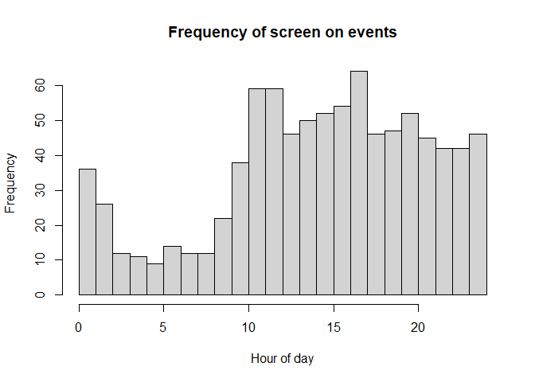

Sleep Prediction
================

<!-- To commit and then push all local file changes to the github repository: -->

<!-- 1) Open up Git Bash -->

<!-- 2) Change directory to "C:/Users/Ian/Dropbox/SleepScreenOnOff/SleepEstimation" -->

<!-- 3) git add . -->

<!-- 4) git commit -m "Commit name here" -->

<!-- 5) git push origin master -->

\#\#\#Create example screen on/off dataset

The following code generates some example screen on/off data for
*ndays=10* days of follow up, with average time to bed at 1:00AM
(*mu\_s=1*) with std. dev. *sd\_s=1* hour. Average time to wake up is
8:30AM (*mu\_w=8.5*) with std. dev. *sd\_w=0.5*. Time between screen on
events is generated according to an exponential distribution with rate
*lambda\_s=0.3* when the person is asleep and rate *lambda\_w=2* when
the person is awake. Smaller rates imply longer waiting times between
phone use, as we might expect when a person is asleep. The *anchor\_t*
parameter should represent an hour of the day that is unlikely to occur
during sleep. In this example *anchor\_t=14* corresponds to 2:00PM. The
starting hour on the first day when data is first collected is
*init\_t=15* (3:00PM).

The generated data is stored in the outmat matrix. This matrix has three
columns, column 1 is the starting time (in hours) of the screen off
interval, column 2 is the ending time (in hours) of the screen off
interval, with column 3 corresponding to the day of follow-up. Note that
starting times (Column 1) are on the interval
*\[anchor\_t,anchor\_t+24\]* rather than *\[0,24\]*. To see the screen
off intervals (*outmat\_mod*) in time-date format where *d0* is the
variable representing the first day of followup, see the *outmat\_orig*
matrix. The *Mod2Orig()* and *Orig2Mod()* functions convert back and
forth between these two data formats (the formats represented by
*outmat\_mod* and *outmat\_orig*).

``` r
ndays=10
lambda_s = 1.5
lambda_w = 5
mu_s = 1
mu_w = 8.5
sd_s = .5
sd_w = 1
init_t = 15
anchor_t=14
d0="3/2/2019" ## d0 is the first day of follow-up. If you have your own data, set d0 equal to the date of first data.

#2pm = origin
A2B_ts = function(xx,anchor_hr=14){
  if(length(xx)>1){
    for(i in 1:length(xx)){
      if(xx[i]<=anchor_hr){
        xx[i]=(24-anchor_hr)+xx[i]
      }else{
        xx[i]=xx[i]-anchor_hr
      }
    }
    return(xx)
  }else{
    if(xx<=anchor_hr){
      return(24-anchor_hr+xx)
    }else{
      return(xx-anchor_hr)
    }
  }
}

## generate time to bed/wake for each day
t_s = rnorm(ndays,mu_s,sd_s)
t_w = rnorm(ndays,mu_w,sd_w)

## generate waiting times
curt = init_t
curday=1
outmat_mod=c()
while(TRUE){
  if(curt>init_t+24){
    curt = curt-24
    curday=curday+1
    if(curday>ndays){
      break
    }
  }
  if(A2B_ts(curt)<A2B_ts(t_s[curday])){
    tnex = curt+rexp(1,lambda_w)
    if(A2B_ts(tnex)>=A2B_ts(t_s[curday])){
      tnex = curt+A2B_ts(t_s[curday])-A2B_ts(curt)+rexp(1,lambda_s)
    }
    outmat_mod=rbind(outmat_mod,c(curt,tnex,curday))
  }else if(A2B_ts(curt)<A2B_ts(t_w[curday])){
    tnex = curt+rexp(1,lambda_s)
    if(A2B_ts(tnex)>=A2B_ts(t_w[curday])){
      tnex = curt+A2B_ts(t_w[curday])-A2B_ts(curt)+rexp(1,lambda_w)
    }
    outmat_mod=rbind(outmat_mod,c(curt,tnex,curday))
  }else{
    tnex = curt+rexp(1,lambda_w)
    outmat_mod=rbind(outmat_mod,c(curt,tnex,curday))
  }
  curt=tnex
}

Mod2Orig = function(tmat,d0,format="%m/%d/%Y %H:%M:%S",tz="EST"){
  tmat_out = matrix(NA,nrow=nrow(tmat),ncol=2)
  t0=as.POSIXct(paste(d0,"00:00:00",sep=" "),tz=tz,format)
  for(i in 1:nrow(tmat)){
    tmat_out[i,1]=strftime(as.POSIXct(as.numeric(t0)+60*60*(tmat[i,1]+24*(tmat[i,3]-1)),tz=tz,origin="1970-01-01"),tz="EST",format)
    tmat_out[i,2]=strftime(as.POSIXct(as.numeric(t0)+60*60*(tmat[i,2]+24*(tmat[i,3]-1)),tz=tz,origin="1970-01-01"),tz="EST",format)
  }
  return(data.frame(t0=tmat_out[,1],t1=tmat_out[,2],stringsAsFactors=F))
}

Orig2Mod = function(tmat,anchor_hr,format="%m/%d/%Y %H:%M:%S",tz="EST"){
  tmat_out = matrix(NA,nrow=nrow(tmat),ncol=3)
  for(i in 1:nrow(tmat)){
    anchor_cur=anchor_hr*60*60+as.numeric(as.POSIXct(strftime(as.POSIXct(tmat[i,1],tz=tz,format=format,origin="1970-01-01"),tz=tz,format="%m/%d/%Y"),tz=tz,format="%m/%d/%Y"))
    if(as.numeric(as.POSIXct(tmat[i,1],tz=tz,format=format,origin="1970-01-01"))<anchor_cur){
      anchor_cur=anchor_hr*60*60+as.numeric(as.POSIXct(strftime(as.POSIXct(as.numeric(as.POSIXct(tmat[i,1],tz=tz,format=format,origin="1970-01-01"))-24*60*60,tz=tz,origin="1970-01-01"),tz=tz,format="%m/%d/%Y"),tz=tz,format="%m/%d/%Y"))
    }
    if(i==1){anchor0=anchor_cur}
    tmat_out[i,1]=anchor_hr+(as.numeric(as.POSIXct(tmat[i,1],tz=tz,format=format,origin="1970-01-01"))-anchor_cur)/(60*60)
    tmat_out[i,2]=anchor_hr+(as.numeric(as.POSIXct(tmat[i,2],tz=tz,format=format,origin="1970-01-01"))-anchor_cur)/(60*60)
    tmat_out[i,3]=round((anchor_cur-anchor0)/(24*60*60))+1
  }
  return(tmat_out)
}

outmat_orig=Mod2Orig(outmat_mod,d0,format="%m/%d/%Y %H:%M:%S") #d0 tells Mod2Orig when the first day of follow-up is.
compare_to_outmat_mod=Orig2Mod(outmat_orig,anchor_hr=anchor_t)

head(outmat_orig)
```

    ##                    t0                  t1
    ## 1 03/02/2019 15:00:00 03/02/2019 15:06:34
    ## 2 03/02/2019 15:06:34 03/02/2019 15:06:56
    ## 3 03/02/2019 15:06:56 03/02/2019 15:12:54
    ## 4 03/02/2019 15:12:54 03/02/2019 15:22:46
    ## 5 03/02/2019 15:22:46 03/02/2019 15:24:00
    ## 6 03/02/2019 15:24:00 03/02/2019 15:36:34

``` r
head(outmat_mod)
```

    ##          [,1]     [,2] [,3]
    ## [1,] 15.00000 15.10946    1
    ## [2,] 15.10946 15.11576    1
    ## [3,] 15.11576 15.21511    1
    ## [4,] 15.21511 15.37955    1
    ## [5,] 15.37955 15.40023    1
    ## [6,] 15.40023 15.60945    1

``` r
head(compare_to_outmat_mod)
```

    ##          [,1]     [,2] [,3]
    ## [1,] 15.00000 15.10944    1
    ## [2,] 15.10944 15.11556    1
    ## [3,] 15.11556 15.21500    1
    ## [4,] 15.21500 15.37944    1
    ## [5,] 15.37944 15.40000    1
    ## [6,] 15.40000 15.60944    1

To see what the resulting data looks like:

``` r
hist(outmat_mod[,1] %% 24,breaks=24,xlim=c(0,24),xlab="Hour of day",main="Frequency of screen on events")
```

<!-- --> Notice how
there are fewer screen on events During the nighttime hours, as
expected.

### Gaussian quadrature for bivariate integration

The time to bed *x\_s* and time to wake *x\_w* is unknown for each night
of follow-up. In this approach, we treat *(x\_s,x\_w)* as a bivariate
normal random variable with mean *(mu\_s,mu\_w)* with
*cor(x\_s,x\_w)=rho* and marginal variances
*(sigma\_s<sup>2,sigma\_w</sup>2)*. To calculate the marginal likelihood
we integrate over the conditional likelihood with respect to
*(x\_s,x\_w)* for each night in follow up. Because this is a Gaussian
integral it can be done efficiently using Guassian quadrature, more
specifically Gauss-Hermite quadrature. The code for this is here:

### Estimating model parameters

Next, we write the likelihood function and use Hermite-Gauss quadrature
to perform numerical integration over the unknown bedtimes and wake-up
times (*x\_s* and *x\_w*). We do a grid search over some of the
parameter space (*rho*, *sigma\_s*, and *sigma\_w*) to pick an initial
value for the numerical optimization of the likelihood, but we make
smarter data-based guesses as initial values for the remaing parameters
(*mu\_s*, *mu\_w*, *lambda\_s*, and *lambda\_w*). Note that we also
allow for the option of setting *rho* equal to zero. This is controlled
by the boolean *incl\_rho* parameter in the FindParamMLEs function, with
a default value of false.

``` r
trap_quad_points = function(numpts){
  maxpt=qnorm(1-.5/numpts)
  pts1=seq(from=-maxpt,to=maxpt,length.out=numpts)
  wts1 = dnorm(pts1)
  dx=2*maxpt/(numpts-1)
  ptinds=as.matrix(expand.grid(rep(list(1:numpts),2)))
  pts=matrix(pts1[ptinds],nrow(ptinds),2)
  wts=apply(ptinds,1,function(xx) prod(wts1[xx])*dx*dx)
  return(list('pts'=pts,'wts'=wts))
}

d_w_cond_x = function(t_init,wt,xs,xw,lambda_s,lambda_w,mu_s,mu_w){
  if(xs>=xw || lambda_s <=0 || lambda_w <= 0 || mu_s >= mu_w){return(0)}
  if(t_init<xs){
    denom = 1-exp(-lambda_w*(xs-t_init))+exp(-lambda_s*(xs-t_init))-exp(-lambda_s*(xw-t_init))+exp(-lambda_w*(xw-t_init))
  }else if(t_init<xw){
    denom = 1-exp(-lambda_s*(xw-t_init))+exp(-lambda_w*(xw-t_init)) 
  }else{
    denom = 1
  }
  if(t_init+wt>xs && t_init+wt<xw){
    numer= lambda_s*exp(-lambda_s*wt)
  }else{
    numer= lambda_w*exp(-lambda_w*wt)
  }
  return(numer/denom)
}


#par order : lambda_s,lambda_w,mu_s,mu_w,sd_s,sd_w
QuadratureIntegral = function(mat,cpar,d){
  n_i=nrow(mat)
  quad_out=trap_quad_points(d)
  lik_wcondx = matrix(NA,nrow=d^2,ncol=n_i)
  for(j in 1:n_i){
    for(i in 1:d^2){
      lik_wcondx[i,j]=d_w_cond_x(t_init=mat[j,1],wt=mat[j,2]-mat[j,1],xs=quad_out$pts[i,1]*cpar[5]+cpar[3],xw=quad_out$pts[i,2]*cpar[6]+cpar[4],cpar[1],cpar[2],cpar[3],cpar[4])
    }
  }
  quad_scaled_w=quad_out$wts/(sum(quad_out$wts))
  logintegrand_p1=sum(rowSums(log(lik_wcondx))*quad_scaled_w)
  return(logintegrand_p1)
}

#par order : lambda_s,lambda_w,mu_s,mu_w,sd_s,sd_w
LogLikelihood =function(dat,cpar,d){
  labels=unique(dat[,3])
  ls_ids = list()
  for(i in 1:length(labels)){
    ls_ids[[i]]=which(dat[,3]==i)
  }
  liktot=0
  for(i in 1:length(labels)){
    mat=dat[ls_ids[[i]],1:2]
    liktot=liktot+QuadratureIntegral(mat,cpar,d=5)
  }
  #Bayesian prior on sleep duration
  POP_AVG_DUR=8
  POP_SD_DUR=1
  ###### SET GAMMA HERE ############
  gamma=.5 #gamma can range from 0 to 1. 1/0 gives largest/smallest penalties from bayesian prior
  ##################################
  liktot=liktot+(length(labels)^gamma)*log(dnorm(abs(cpar[4]-cpar[3]),mean=POP_AVG_DUR,sd=POP_SD_DUR))
  #Bayesian prior on sd of time to sleep
  liktot=liktot+(length(labels)^gamma)*log(dnorm(cpar[5],mean=1.2,sd=.5))
  #Bayesian prior on sd of time to wake
  liktot=liktot+(length(labels)^gamma)*log(dnorm(cpar[6],mean=1.2,sd=.5))
  return(liktot)
}

InitialParameters = function(mat_mod,anchor_t=14){
  MIN_LAMBDA = .00001 # smallest value lambda can be
  itrvl_len_v = seq(6,9,.5)
  out_ls=list()
  ratio_v = rep(NA,length(itrvl_len_v))
  # find mu_s0, mu_w0
  for(j in 1:length(itrvl_len_v)){
    itrvl_len=itrvl_len_v[j]
    start_vals=seq(0,24-itrvl_len,.25)
    frac_vals = rep(NA,length(start_vals))
    for(i in 1:length(start_vals)){
      frac_vals[i]=length(intersect(which(mat_mod[,1]>anchor_t+start_vals[i]),which(mat_mod[,1]<anchor_t+start_vals[i]+itrvl_len)))/nrow(mat_mod)
    }
    mu_s0=start_vals[order(frac_vals)[1]]+anchor_t
    mu_w0=mu_s0+itrvl_len
    # find rate during average sleep and average waking interval
    ndays= length(unique(mat_mod[,3]))
    lambda_s0=max(c((min(frac_vals)*nrow(mat_mod)/ndays)/itrvl_len,MIN_LAMBDA))
    lambda_w0=max(c(((1-min(frac_vals))*nrow(mat_mod)/ndays)/(24-itrvl_len),MIN_LAMBDA))
    out_ls[[j]]=list(mu_s0,mu_w0,lambda_s0,lambda_w0)
    ratio_v[j]=lambda_s0/lambda_w0
  }
  return(unlist(out_ls[[order(ratio_v)[1]]]))
}

#par order : lambda_s,lambda_w,mu_s,mu_w,sd_s,sd_w
GridSearchInitPars = function(mat_mod,mu_s0,mu_w0,lambda_s0,lambda_w0,d){
  sd_s_v = c(.25,.5,1)
  sd_w_v = c(.25,.5,1)
  minval=-Inf
  for(sd_s in sd_s_v){
    for(sd_w in sd_w_v){
      par_v=c(lambda_s0,lambda_w0,mu_s0,mu_w0,sd_s,sd_w)
      curval=LogLikelihood(mat_mod,par_v,d)
      if(curval>minval){
        cur_par=par_v
        minval=curval
      }
    }
  }
  return(par_v)
}

#par order : lambda_s,lambda_w,mu_s,mu_w,sd_s,sd_w
GetIndSleepEstimates =function(mat_mod,cpar){
  labels=unique(mat_mod[,3])
  ls_ids = list()
  for(i in 1:length(labels)){
    ls_ids[[i]]=which(mat_mod[,3]==i)
  }
  xmat = matrix(NA,nrow=length(labels),ncol=3)
  for(i in 1:length(labels)){
    mat=mat_mod[ls_ids[[i]],1:2]
    g3=function(par_v){
      tot=0
      for(j in 1:nrow(mat)){
        tot=tot-log(d_w_cond_x(t_init=mat[j,1],wt=mat[j,2]-mat[j,1],xs=par_v[1],xw=par_v[2],cpar[1],cpar[2],cpar[3],cpar[4]))
      }
      tot=tot-dnorm(par_v[1],cpar[3],cpar[5],log=TRUE)-dnorm(par_v[2],cpar[4],cpar[6],log=TRUE)
      ##### PENALIZE SLEEP DURATION
      IND_SD_DUR=1
      ############ SET GAMMA HERE #################
      gamma=0 #gamma can range from 0 to 1. 1/0 gives largest/smallest penalties
      #############################################
      tot=tot-(length(labels)^gamma)*dnorm(par_v[2]-par_v[1],mean=cpar[4]-cpar[3],IND_SD_DUR,log=TRUE)
      ##### 
      return(tot)
    }
    optim.out3=optim(par=cpar[3:4],g3,control=list(maxit=1000))
    xmat[i,]=c(optim.out3$par,labels[i])
  }
  return(xmat)
}


#par order : lambda_s,lambda_w,mu_s,mu_w,sd_s,sd_w
NumMaxLogLik = function(outmat_mod,anchor_t=14,d=3){
  iparinit=InitialParameters(outmat_mod,anchor_t)
  ipar=GridSearchInitPars(outmat_mod,mu_s0=iparinit[1],mu_w0=iparinit[2],lambda_s0=iparinit[3],lambda_w0=iparinit[4],d)
#  ipar = c(1,3,mu_s+24+2,mu_w+24+2,2,.5)
  g1=function(cpar){
    return(-LogLikelihood(outmat_mod,cpar,d))
  }
  optim.out1=optim(par=ipar,g1,control=list(maxit=1000))
  return(optim.out1$par)
}


mle.out=NumMaxLogLik(outmat_mod)
```

The maximum likelihood estimates and the interpretations of the model
parameters are:

``` r
#par order : lambda_s,lambda_w,mu_s,mu_w,sd_s,sd_w

sleep_t_h=floor(mle.out[3]%%24)
sleep_t_m=floor((mle.out[3]%%24-floor(mle.out[3]%%24))*60)
if(sleep_t_m<10){
  sleep_t=paste(sleep_t_h,":0",sleep_t_m,sep="")
}else{
  sleep_t=paste(sleep_t_h,":",sleep_t_m,sep="")
}
wake_t_h=floor(mle.out[4]%%24)
wake_t_m=floor((mle.out[4]%%24-floor(mle.out[4]%%24))*60)
if(wake_t_m<10){
  wake_t=paste(wake_t_h,":0",wake_t_m,sep="")
}else{
  wake_t=paste(wake_t_h,":",wake_t_m,sep="")
}
cat(paste(" Avg. time to sleep = ",sleep_t," (+/- ",round(mle.out[5],1)," hour)\n",sep="")
,(paste("Avg. time to wake  = ",wake_t," (+/- ",round(mle.out[6],1)," hour)\n",sep=""))
#,(paste("Correlation between time to sleep and time to wake = ",round(mle.out[5],2),"\n",sep=""))
,(paste("Rate (per hour) of frequency of phone use while asleep = ", round(mle.out[1],5),"\n",sep=""))
,(paste("Rate (per hour) of frequency of phone use while awake = ", round(mle.out[2],5),"\n",sep="")))
```

    ##  Avg. time to sleep = 2:11 (+/- 0.7 hour)
    ##  Avg. time to wake  = 9:11 (+/- 1.1 hour)
    ##  Rate (per hour) of frequency of phone use while asleep = 2.03841
    ##  Rate (per hour) of frequency of phone use while awake = 5.13881

### Estimating bed times and wake up times for each day

Now that the model parameters have been estimated, we can maximize the
joint density function of a) the bed times (*x\_s*), b) the wake-up
times (*x\_w*), and c) the screen on/off data, with respect to the
*x\_s* and *x\_w*. These will be our bed time and wake-up time estimates
for each individual night. The rationale for maximizing the joint
likelihood is that the distribution of the *x\_s* and *x\_w* will pull
estimates towards *mu\_s* and *mu\_w*, respectively, while the
distribution of the screen on/off data will pull bedtime and wake-up
estimates towards the data fit. This way if there is very little data,
then bedtime and wake-up estimates will be close to *mu\_s* and *mu\_w*,
while more data will allow us to trust the data more and estimates will
reflect that. This balance is ideal for situations where sparse data may
be present.

Let’s run the function GetIndSleepEstimates on our simulated data
(*outmat\_mod*) using the parameter MLEs (*mle.out*) we just estimated
as input.

``` r
xest=GetIndSleepEstimates(outmat_mod,mle.out)
```

*xest* contains each day’s estimated bedtimes and wake-up times. Let’s
convert back to the original time scale using the Mod2Orig() function we
defined before.

``` r
xest_orig=Mod2Orig(xest,d0,format="%m/%d/%Y %H:%M:%S")
names(xest_orig)=c("bedtime","wake-up time")
xest_orig
```

    ##                bedtime        wake-up time
    ## 1  03/03/2019 02:19:30 03/03/2019 08:19:05
    ## 2  03/04/2019 02:41:41 03/04/2019 09:58:43
    ## 3  03/05/2019 02:27:24 03/05/2019 09:12:13
    ## 4  03/06/2019 02:46:43 03/06/2019 09:54:30
    ## 5  03/07/2019 02:33:08 03/07/2019 09:38:47
    ## 6  03/08/2019 02:10:28 03/08/2019 09:16:08
    ## 7  03/09/2019 02:16:07 03/09/2019 08:27:13
    ## 8  03/10/2019 02:36:16 03/10/2019 09:01:55
    ## 9  03/11/2019 02:30:15 03/11/2019 09:23:05
    ## 10 03/12/2019 02:20:18 03/12/2019 08:23:15
